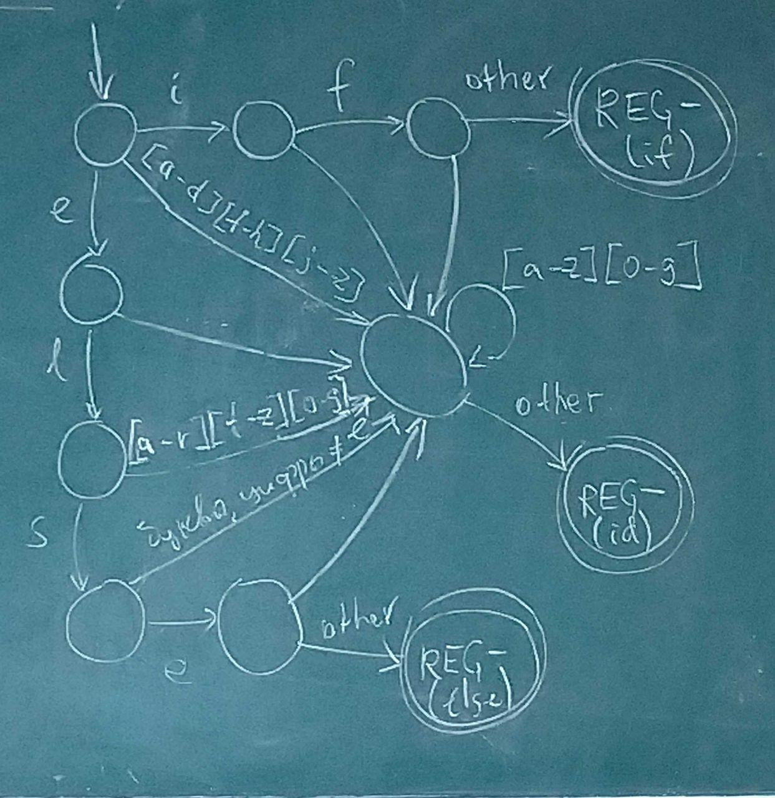

> *09.04.2019*

### Лексический анализ

**Лексема** — элементарная смысловая единица текста. Могут объединяться в классы эквивалентности — **токены**. Описываются токены с помощью **шаблонов**.

> Классы идентификаторов. Одноэлементные классы ключевых слов.

| Токен  | Пример лексемы  | Шаблон                                 |
| ------ | --------------- | -------------------------------------- |
| if     | if              | `if`                                   |
| cop    | <=, >=, ==, …   | `<=?|>=?|[=!]=`                        |
| id     | pi, var23       | `[a-z]\d*`                             |
| number | 1.09, -2.75e-30 | `-?0|[1-9]\d*(.\d{1,})?(e-?[1-9]\d*)?` |

> Первая колонка — имя, которое будет приходить на вход синтаксическому анализатору. comparison operator

#### Распознавание лексем

Вся собранная информация сохраняется в **таблице символов** — структуре данных для хранения информации об идентификаторах.

##### **Буферизация**

|  |  |  |  |  |  |  |  |         |  |  |  |  |  |  |  |  | 
​	   $\uparrow$ 						$\uparrow$
​	*begin*					*current*

*begin* — начало текущей лексемы, протяжённость которой мы пытаемся определить.
*current* — текущий сканируемый символ.

Зачем два буфера? По одному символу может быть невозможно определить, какая перед нами лексема. Если указатель current дошёл до конца одного буфера, то все уже прочитанные символы можно скопировать во второй.

##### **Регистрация токена**

REG — функция, которая точно знает где начался и закончился токен. Делает запись в таблицу символов: какой это был оператор, где он находился в исходном тексте. Нужно для обработчика ошибок.

REG- — до предпоследнего символа.

Токен = <имя, атрибут>. Атрибут — ссылка на запись в таблице символов. Имя используется в лексическом анализе.

**Примеры диаграмм переходов**

##### **Ошибки**

- несуществующий переход в автомате

##### **Обработка ошибок**

> Не хотим сразу навсегда ломаться, а выдавать все ошибки за раз.

**Режим паники** — пропускаем всё, пока не встретим корректные символы.

Но можно подумать, а может ли префикс оставшийся строки быть преобразован в корректную лексему и сделать что-то из списка:

- пропуск одного символа;
- вставка пропущенного символа;
- замена символа;
- перестановка соседних символов.

### Синтаксический анализ

**Задача** — определить принадлежность слова языку, который задан некоторой КС грамматикой. Грамматика описывает **синтаксис**! Также нужно построить дерево вывода и сообщить об ошибках.

**Типы анализаторов**

- универсальные (алгоритм КЯК);
- нисходящие (восстановление дерева от корня к листьям);
- восходящие.

**Разделённая грамматика**

$\forall A \in \Gamma: (\forall (A \rightarrow \gamma) \in P$ все $\gamma$ начинаются с разных терминалов$)$

> До этого было: $A \rightarrow \gamma$     $\forall a \in Z :(A, a) \rightarrow (\gamma, —)$

