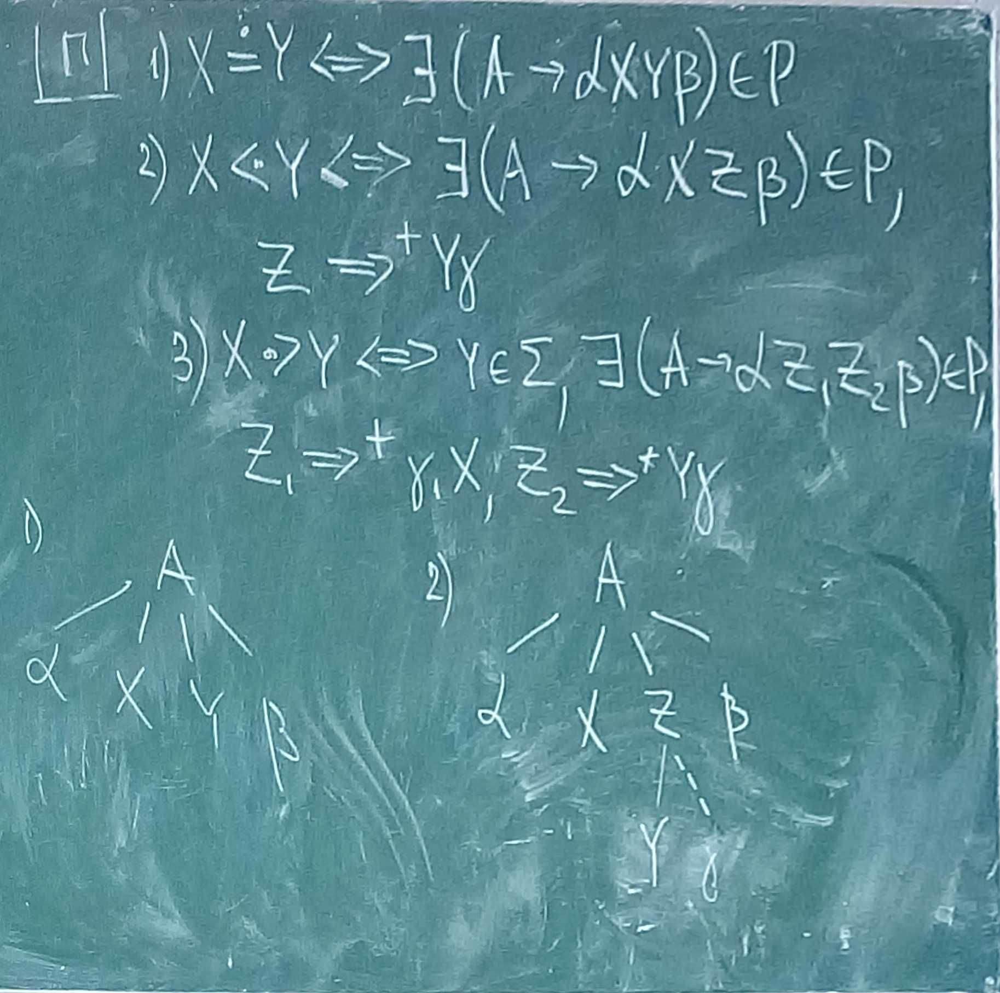
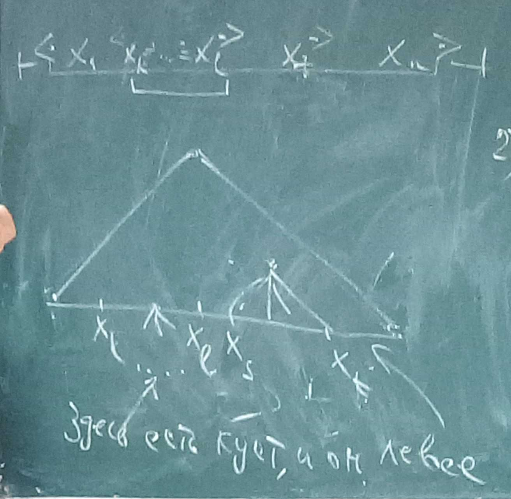

### Восходящий анализ

Пока что рассматриваем однозначные, приведённые,  $\lambda$-свободные и **обратимые** грамматики (*последние 2 условия потом дропнем*). А ещё вывод теперь **право**сторонний!

<u>Опр</u>. **Обратимая** грамматика — у одинаковых правых частей правил вывода нет разных левых частей.

r-форма == правая форма.

<u>Опр</u>.  **Основа $\beta$** r-формы $\gamma$: $\gamma=\alpha\beta v, \exists (A \rightarrow \beta) \in P$. 
Другими словами: $S \Rightarrow^* \alpha A v \Rightarrow \alpha\beta v \Rightarrow ...$

> Ещё другими словами: **основа** — цепочка символов, которую можно “свернуть” до нетерминала. При этом всё, что находится после основы и после нетерминала, к которому сворачиваемся, должно быть терминальным! Потому что восстанавливаем правосторонний вывод.

Теперь нам надо исходя из цепочки терминальных символов получать все промежуточные нетерминалы, т.е. строить дерево снизу вверх, постепенно поднявшись до аксиомы.

**Пример**

$S \rightarrow aSAb|c$

$A \rightarrow Ab|b$

$w = acbbb$

Построим для этой цепочки дерево восходящим образом. Пока что нам основы будут подсказывать. Переносим все символы в стек, пока не найдём основу. Потом сворачиваем её к её нетерминалу и продолжаем.

1. $a$
2. $ac$: $c$ соответствует основе. Уберём её, заменив на левую часть $\rightarrow aS$
3. $aSb \rightarrow aSA$
4. $aSAb$: тут на основу претендуют 3 цепочки — $b$, $Ab$ и $aSAb$. Но мы знаем, что лучше использовать правило $Ab \rightarrow aSA$
5. $aSAb \rightarrow S$

Дерево вывода:

```
    S
  //| \
/ /  \ \  
| |   A \
| |  / \ \
| S  A  | |
| |  |  | |
a c  b  b b 
```

Этот метод называется **технология "перенос-свёртка"**. Все остальные методы различаются способом определения основы.

<u>Опр</u>. **Куст** — поддерево $K$ дерева $T$ высоты 1, такое, что:

- все его листья — листья в исходном дереве;
- у корня куста все сыновья в $T$ — листья в $K$.

Свёртка соответствует обрезанию самого левого куста

```
    S
  //| \
/ /  \ \  
| |   A \
| |  / \ \
| S  A  | |
| |  |  | |
a c  b  b b 
  1 куст
  
     S
  //| \
/ /  \ \  
| |   A \
| |  / \ \
| S  A  | |
|    |  | |
a    b  b b 
	 2 куст
	 
	S
  //| \
/ /  \ \  
| |   A \
| |  / \ \
| S  A  | |
|       | |
a       b b 
	  3 куст
	 
	S
  //| \
/ /  \ \  
| |   A \
| |      \
| S       |
|         |
a         b 
всё дерево - куст, осталась только аксиома
	S
```

$S \Rightarrow aSAb \Rightarrow aSAbb \Rightarrow aSbbb \Rightarrow acbbb$

> Получено справа налево.


**Инвариант восходящего анализа** — произведение (конкатенация) содержимого стека на необработанную часть строки — всегда r-форма

Любой восходящий анализатор начинает работу с **пустым** стеком!


<u>Предложение</u>. При использовании технологии "перенос-свёртка" в любой момент времени правый конец основы либо находится на вершине стека, либо ещё не перенесён в стек.

**Д-во** — индукция по порядку свёрток

**БИ**. Первый раз, когда делается свёртка, основа полностью находится в стеке просто по алгоритму.

**ШИ**. Рассмотрим два шага в последовательном выводе терминальной цепочки:

1. $S \Rightarrow^* \alpha A v_1 B v_2 \Rightarrow \alpha A v_1 u v_2 \Rightarrow \alpha \gamma v_1 u v_2$

   > Было 2 нетерминала. Крайний правый раскрывается в цепочку *терминалов*. Теперь предыдущий нетерминал стал крайним правым, он раскрывается.

2. $S \Rightarrow^* \alpha A v \Rightarrow \alpha \beta B u v \Rightarrow \alpha \beta \gamma u v$

   >Был 1 нетерминал. Он раскрывается в цепочку *терминалов и нетерминалов*. Из этой новой цепочки снова раскрывается самый правый.


Сворачиваем $\gamma$. По ПИ — последний символ $\gamma$ (вершина стека) принадлежит основе. Так как произведение содержимого стека на необработанную часть строки — r-форма, то рано или поздно мы получим такой стек и такой кусочек строки, как ниже:

1.  Перед свёрткой, по ПИ всё ок:  			  После свёртки:
      		 $v_1 u v_2$ 														$v_1 u v_2$ 
   $\gamma$			  				 								   $A$
   $\alpha$							  									$\alpha$			
   $\nabla$ 						 	  					  	       $\nabla$

   > На вершине стека теперь $A$. Форма $\alpha A v_1 u v_2$ была получена из формы $\alpha A v_1 B v_2$, по правилу $B \rightarrow u$. Новая основа — $u$, и её правый конец ещё не перенесён в стек.

2.  Перед свёрткой, по ПИ всё ок:  			  После свёртки:
      		 $u v$ 																$u v$ 
   $\gamma$			  				 								   $B$
   $\beta$							  									$\beta$		
   $\alpha	$											 		      	   $\alpha$
   $\nabla$ 						 	  					  	       $\nabla$

   > На вершине стека теперь $B$. Форма $\alpha \beta B u v$ была получена из формы $\alpha A v$, по правилу $A \rightarrow \beta B u$. Новая основа — $\beta B u$, и её правый конец ещё не перенесён в стек.

$\blacksquare$


> Благодаря этому факту нам не надо искать основу внутри стека! Достаточно один или несколько раз перенести символ для получения новой основы.


#### Способы определения основы

##### Анализ на основе отношений предшествования

Ограничения на грамматику: ацикличная, обратимая, $\lambda$-свободная.

Отношения строятся на декартовом произведении терминальных и нетерминальных символах грамматики — на $(\Sigma \cup \Gamma)^2$

1. $X \doteq Y$, если $XY$ — подслово основы некоторой r-формы
2. $X \lessdot Y$, если $\exists$ r-форма: её основа начинается с $Y$, перед ней находится $X$
3. $X \gtrdot Y$, если $ \exists$ r-форма: её основа заканчивается на $X$, за ней находится $Y$


<u>Предложение</u>

1. $X \doteq Y \iff \exists (A \rightarrow \alpha XY \beta) \in P$
2. $X \lessdot Y \iff \exists(A \rightarrow \alpha XZ\beta) \in P, Z \Rightarrow^+ Y\gamma$
3. $X \gtrdot Y \iff Y \in \Sigma, \exists (A \rightarrow\alpha Z_1Z_2\beta) \in P, Z_1  \Rightarrow^+ \gamma_1X, Z_2  \Rightarrow^+  Y\gamma_2$

**Д-во**: 

1. Если $X \doteq Y$, то по определению отношения $\doteq$  основа некоторой r-формы имеет вид $\alpha XY \beta$. А раз это основа, то должно быть и правило $A \rightarrow \alpha XY \beta$.

   Обратно, дано $A \rightarrow \alpha XY \beta$. Грамматика приведённая, значит, участвует в выводе терминальной цепочки: $S\Rightarrow^* \xi Au \Rightarrow \xi \alpha XY \beta u \Rightarrow^* w$. По определению, $\alpha XY \beta$ — основа, отсюда $X \doteq Y$.

2. Если $X \lessdot Y$

   …. *смотри на граф и думай*

   Обратно, $\exists(A \rightarrow \alpha XZ\beta) \in P, Z \Rightarrow^+ Y\gamma$.

   Рассмотрим правосторонний вывод $S\Rightarrow^* \xi Au \Rightarrow \xi \alpha X Z\beta u \Rightarrow^* \xi \alpha X Zv u \Rightarrow^+ \xi\alpha X Y\gamma' v u \Rightarrow^* w$.

   > $\beta \Rightarrow^* v$ — вывод терминальной цепочки
   >
   > $Z \Rightarrow^+ Y\gamma$, значит, в какой то момент в одной из r-форм возник $Y$ на первом месте. Пусть это будет $Y\gamma'$.

   Первая основа —  $Y\gamma'$. Слева от неё — $X$. Значит, $X \lessdot Y$. 

   

3. Если $X \gtrdot Y$

   …. *смотри на граф и думай*

   Обратно, $Y$ — терминал, $\exists (A \rightarrow\alpha Z_1Z_2\beta) \in P, Z_1  \Rightarrow^+ \gamma_1X, Z_2  \Rightarrow^+  Y\gamma_2$.

   $S \Rightarrow^* \xi Au \Rightarrow \xi \alpha Z_1Z_2\beta u \Rightarrow ^*\xi \alpha Z_1Z_2vu \Rightarrow^+ \xi \alpha \gamma_1XZ_2vu \Rightarrow^+ \xi \alpha \gamma_1XY\gamma_2vu \Rightarrow^* \xi \alpha \gamma_1XY\gamma_2'vu \Rightarrow^* w$

   > $\beta \Rightarrow^* v$, $\gamma_2 \Rightarrow^* \gamma_2'$ — вывод терминальной цепочки

   Начиная с $Y$ — терминалы, значит, основа кончается на $X$. Значит, $X \gtrdot Y$.


$\blacksquare$

   

   




FIRST'(X) — символы, выводящиеся на первом месте из X за 1 и более шагов

LAST'(X) — символы, выводящиеся на последнем месте из X за 1 и более шагов

> Без штриха — ровно за 1 шаг


$X \lessdot Y \iff \exists(A \rightarrow \alpha XZ\beta) \in P, Y \in FIRST'(Z)$

$X \gtrdot Y \iff \exists (A \rightarrow\alpha Z_1Z_2\beta) \in P,\ Y \in \Sigma,\ X \in LAST'(Z_1)$ и $(Y=Z_2$ или $Y \in FIRST'(Z_2))$


$\vdash \lessdot X$, если с $X$ начинается r-форма 

$X \gtrdot \dashv$, если на $X$ заканчивается r-форма 

> Левый болт может быть только меньше чего то, а правый — только больше.


**Пример**

$S \rightarrow aSAb|c$

$A \rightarrow Ab|b$

|          | $S$        | $A$                  | $a$        | $b$        | $c$        | $\dashv$  |
| -------- | ---------- | -------------------- | ---------- | ---------- | ---------- | --------- |
| $S$      |            | $\doteq$, $\lessdot$ |            | $\lessdot$ |            | $\gtrdot$ |
| $A$      |            |                      |            | $\doteq$   |            |           |
| $a$      | $\doteq$   |                      | $\lessdot$ |            | $\lessdot$ |           |
| $b$      |            | $\gtrdot$            |            | $\gtrdot$  |            | $\gtrdot$ |
| $c$      |            | $\gtrdot$            |            | $\gtrdot$  |            | $\gtrdot$ |
| $\vdash$ | $\lessdot$ |                      | $\lessdot$ |            | $\lessdot$ |           |

Между соседними элементами в правилах — равенство (слева направо, не коммутативно!)

|      | FIRST' | LAST' |
| ---- | ------ | ----- |
| $S$  | $a,c$  | $b,c$ |
| $A$  | $A, b$ | $b$   |

С тем, что выводится из соседа первым, $X$ будет в отношении меньше

Чтобы построить $\gtrdot$ нам нужно рассмотреть пары, в которых втором месте — терминалы из основы или символы из множества FIRST’.


> *21.05.19*

<u>Опр</u>. G — грамматика **простого предшествования**, если она ациклична и для любой пары символов в G выполнено не более одного отношения предшествования.

<u>Предложение</u>. Пусть G — ПП-грамматика, $\vdash \gamma\dashv=x_0x_1...x_nx_{n+1}$ — её r-форма. Тогда $x_k...x_l$ — основа этой формы, если $x_l \gtrdot x_{l+1}$ и $l$ — минимальное с таким свойством: $x_{k-1}\lessdot x_k, x_k\doteq x_{k+1}\doteq...\doteq x_l$.

> Берём форму, располагаем отношения, находим самое левое больше, и ближайшее к нему меньше (равенство между ними можно). Это будет основа, которую надо свернуть к нужному нетерминалу.

 **Доказательство**. $\vdash \gamma\dashv$ — r-форма, $x_s...x_t$ — её основа. $x_t \gtrdot x_{t_1}$ по опр. $\Rightarrow$ $t > l$.

О.П. Предполагаем, что есть кандидат на основу правее, чем текущая. Но это не так - у r-формы основа это самый левый куст.

1. $s > l$

   $x_s…x_t$ соответствуют самому левому кусту

2. $x_t \gtrdot x_{l+1}$ $\Rightarrow$ $x _l$ не имеет правых братьев. Среди левых братьев $x_l$ есть внутренний узел.



$\blacksquare$

**Пример**

$S \rightarrow aSSb|c$

|          | $S$        | $a$        | $b$       | $c$        | $\dashv$  |
| -------- | ---------- | ---------- | --------- | ---------- | --------- |
| $S$      | $\doteq$   | $\lessdot$ | $\doteq$  | $\lessdot$ | $\gtrdot$ |
| $a$      | $\doteq$   | $\lessdot$ |           | $\lessdot$ |           |
| $b$      |            | $\gtrdot$  | $\gtrdot$ | $\gtrdot$  | $\gtrdot$ |
| $c$      |            | $\gtrdot$  | $\gtrdot$ | $\gtrdot$  | $\gtrdot$ |
| $\vdash$ | $\lessdot$ | $\lessdot$ |           | $\lessdot$ |           |

$FIRST'(S) = \{a,c\}$
$LAST'(S) = \{b,c\}$

> Какие то магические иероглифы
>
> 


<u>Опр</u>.  Грамматика **слабого предшествования** — ПП-грамматика, в которой отношения $\lessdot$ и $\doteq$ могут иметь общие элементы.

Для того, чтобы найти левый конец основы в такой грамматике, надо найти правило вывода, правая часть которого расположена левее найденного правого конца. Трудность возникает в том случае, когда анализируемая цепочка имеет вид  $\alpha\beta'\beta w$, правый конец расположен между $\beta$ и $w$ и имеется два правила вывода $A \rightarrow \beta'\beta$ и $B \rightarrow \beta$. В этой ситуации неясно, какое из них применять для свертки. Мы будем применять *наиболее длинное из возможных правил*. Класс грамматик, для которых такое решение всегда является корректным, и будет искомым расширением класса ПП-грамматик. 


> *28.05.2019*

##### Языки выражений

<u>Опр</u>.  **Выражение** состоит из:

- операндов
- операторов
- скобок

*Семантическое значение выражения* определяется значениями атомарных операндов и порядком выполнения операций, который естественно описывать при помощи дерева.

*Порядок выполнения*, там где он не указан явно при помощи скобок, основан на соглашениях о *приоритете* операторов и их *ассоциативности*, т.е. порядке выполнения одноименных операторов. 

К примеру, возведение в степень правоассоциативно, а его приоритет выше приоритета умножения. Умножение, в свою очередь, левоассоциативно, и имеет приоритет выше приоритета сложения. 

##### Анализ на основе отношений операторного предшествования

<u>Опр</u>. **Операторная** грамматика — в правой части правила вывода между любыми двумя нетерминалами обязательно есть терминал.

Вспомним пример неоднозначной грамматики: $E \rightarrow E + E | E*E | (E)|x$. После того, как мы сделали её однозначной, она стала очень большой.

<u>Замечание</u>. Если цепочка $aEb$ входит в r-форму и ровно один из $a$,$b$ принадлежит основе, то и $E$ принадлежит основе.

> В любой r-форме операторной грамматике тоже не встретится двух нетерминалов подряд.
>
> Если основа не включает в себя символ E, то после свёртки получится два нетерминала подряд. Но это ещё не правило, а только форма. Но в конце концов мы дойдём до основы, которая представляет собой форму с двумя соседними нетерминалами. А такого правила нет. Противоречие.


<u>Опр</u>. Отношения приоритета для двух соседних терминалов:

- $a \lessdot b$, если $a$ имеет меньший приоритет;
- $a \doteq b$, если $a$ и $b$ сворачиваются одновременно;
- $a \gtrdot b$, если  $a$ имеет больший приоритет;
- $\vdash  \lessdot a$, если на $a$ может начинаться r-форма;
- $a \gtrdot \dashv$, если на $a$ может заканчиваться r-форма.


> Свёртка == применение оператора


Добавим к нашей арифметической грамматике унарный минус и функцию:

 $E \rightarrow E + E | E*E | (E)|-E|min(E,E)|x$

|          | $x$        | $($        | $)$       | $-$        | $+$        | $*$        | $min$      | $,$       | $\dashv$  |
| -------- | ---------- | ---------- | --------- | ---------- | ---------- | ---------- | ---------- | --------- | --------- |
| $x$      |            |            | $\gtrdot$ |            | $\gtrdot$  | $\gtrdot$  |            | $\gtrdot$ | $\gtrdot$ |
| $($      | $\lessdot$ | $\lessdot$ | $\doteq$  | $\lessdot$ | $\lessdot$ | $\lessdot$ | $\lessdot$ | $\doteq$  |           |
| $)$      |            |            | $\gtrdot$ |            | $\gtrdot$  | $\gtrdot$  |            | $\gtrdot$ | $\gtrdot$ |
| $-$      | $\lessdot$ | $\lessdot$ | $\gtrdot$ | $\lessdot$ | $\gtrdot$  | $\gtrdot$  | $\lessdot$ | $\gtrdot$ | $\gtrdot$ |
| $+$      | $\lessdot$ | $\lessdot$ | $\gtrdot$ | $\lessdot$ | $\gtrdot$  | $\lessdot$ | $\lessdot$ | $\gtrdot$ | $\gtrdot$ |
| $*$      | $\lessdot$ | $\lessdot$ | $\gtrdot$ | $\lessdot$ | $\gtrdot$  | $\gtrdot$  | $\lessdot$ | $\gtrdot$ | $\gtrdot$ |
| $min$    |            | $\doteq$   |           |            |            |            |            |           |           |
| $;$      | $\lessdot$ | $\lessdot$ | $\doteq$  | $\lessdot$ | $\lessdot$ | $\lessdot$ | $\lessdot$ |           |           |
| $\vdash$ | $\lessdot$ | $\lessdot$ |           | $\lessdot$ | $\lessdot$ | $\lessdot$ | $\lessdot$ |           |           |

На нетерминалы мы не смотрим! Поэтому в $(E+E)$ плюс и скобка - соседи!

Операторы сворачиваются раньше всех, значит он больше всего, что за ним может следовать

$(-$ минус должен свернуться раньше, поэтому скобка меньше.


Пустые клетки таблицы означают , что данные нетерминалы не могут соседствовать в r-форме. Например, последним нетерминалом не может быть левая скобка, так как после нее обязательно должна присутствовать правая; после правой скобки не может идти $x$, так как и фрагмент, заканчивающийся правой скобкой, и $x$ сворачиваются в нетерминал; и т . д.


**Пример**

$x*-min(x;x+x)$

$\vdash \lessdot x \gtrdot$
$\vdash_E\lessdot * \lessdot - \lessdot min \doteq (\lessdot x \gtrdot $ - E - не смотрим на левую (?) часть. Удлиняем основу, пока не встретим $\gtrdot$
$\vdash_E \lessdot * \lessdot - \lessdot min \doteq (_E \doteq ; _E \lessdot +_E \gtrdot $
													$\uparrow$        $\uparrow$
													Две ешки соседствуют, значит это всё основа

$\vdash_E \lessdot * \lessdot - \lessdot min \doteq (_E \doteq ; _E\doteq)\gtrdot$
							$\uparrow$      Основа      $ \uparrow$

$\vdash_E \lessdot * \lessdot -_E\gtrdot \dashv$
$\vdash_E \lessdot *_E\gtrdot \dashv$
$\vdash_E \dashv$ — готово!


Пример, на котором показано, как важно правильно определять основу.

$x-x$

$\vdash_E\lessdot-_E\gtrdot$ — на следующем шаге начнётся плохо, потому что самый левый $E$ надо включить в основу


<u>Лемма</u>. Любая грамматика эквивалента некоторой операторной грамматике.

Отсюда возникает соблазн всегда пользоваться этим способом. Но:

- Размер грамматики вырастает экспоненциально, и время на обработку тоже;
- В таблице приоритетов могут получиться пересечения, и мы не сможем найти основу;
- После отождествления нетерминалов язык мог измениться.


Отобразим каждый терминал в два натуральных числа, для левого приоритета и правого приоритета:

$a \in \Sigma: l(a), r(a) \in N$:

- $l(a) < r(b)$, если $a \lessdot b$;
- $l(a) = r(b)$, если $a \doteq b$;
- $l(a) > r(b)$, если $a \gtrdot b$.

Если мы построили такую функцию, то у нас пропали пустые ячейки в таблице. Но невозможных соседей всё равно обнаружат при попытке свернуть неправильную основу.