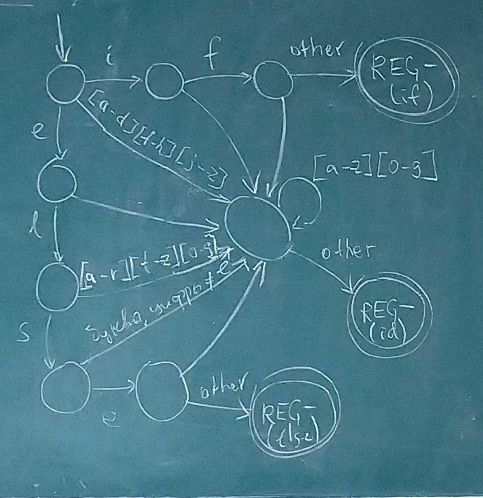
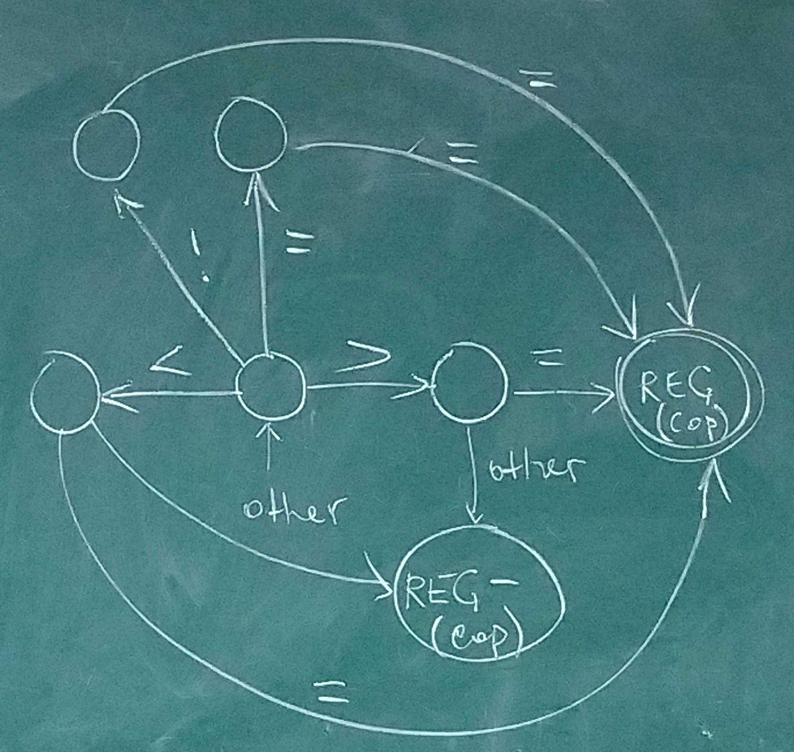

> *09.04.2019*

### Лексический анализ

**Лексема** — элементарная смысловая единица текста. Могут объединяться в классы эквивалентности — **токены**. Описываются токены с помощью **шаблонов**.

> Классы идентификаторов. Одноэлементные классы ключевых слов.

| Токен  | Пример лексемы  | Шаблон                                 |
| ------ | --------------- | -------------------------------------- |
| if     | if              | `if`                                   |
| cop    | <=, >=, ==, …   | `<=?|>=?|[=!]=`                        |
| id     | pi, var23       | `[a-z]\d*`                             |
| number | 1.09, -2.75e-30 | `-?0|[1-9]\d*(.\d{1,})?(e-?[1-9]\d*)?` |

> Первая колонка — имя, которое будет приходить на вход синтаксическому анализатору. comparison operator

#### Распознавание лексем

Вся собранная информация сохраняется в **таблице символов** — структуре данных для хранения информации об идентификаторах.

##### **Буферизация**

|  |  |  |  |  |  |  |  |         |  |  |  |  |  |  |  |  | 
​	   $\uparrow$ 						$\uparrow$
​	*begin*					*current*

*begin* — начало текущей лексемы, протяжённость которой мы пытаемся определить.
*current* — текущий сканируемый символ.

Зачем два буфера? По одному символу может быть невозможно определить, какая перед нами лексема. Если указатель current дошёл до конца одного буфера, то все уже прочитанные символы можно скопировать во второй.


##### **Регистрация токена**

REG — функция, которая точно знает где начался и закончился токен. Делает запись в таблицу символов: какой это был оператор, где он находился в исходном тексте. Нужно для обработчика ошибок.

REG- — до предпоследнего символа.

Токен = <имя, атрибут>. Атрибут — ссылка на запись в таблице символов. Имя используется в лексическом анализе.


**Примеры диаграмм переходов**







##### **Ошибки**

- несуществующий переход в автомате

##### **Обработка ошибок**

> Не хотим сразу навсегда ломаться, а выдавать все ошибки за раз.

**Режим паники** — пропускаем всё, пока не встретим корректные символы.

Но можно подумать, а может ли префикс оставшийся строки быть преобразован в корректную лексему и сделать что-то из списка:

- пропуск одного символа;
- вставка пропущенного символа;
- замена символа;
- перестановка соседних символов.


## Синтаксический анализ

**Задача** — определить принадлежность слова языку, который задан некоторой КС грамматикой. Грамматика описывает **синтаксис**! Также нужно построить дерево вывода и сообщить об ошибках.

**Типы анализаторов**

- универсальные (алгоритм КЯК);
- нисходящие (восстановление дерева от корня к листьям);
- восходящие.


**Разделённая грамматика**

$\forall A \in \Gamma: (\forall (A \rightarrow \gamma) \in P$ все $\gamma$ начинаются с разных терминалов$)$

> До этого было: $A \rightarrow \gamma$     $\forall a \in Z :(A, a) \rightarrow (\gamma, —)$


### Нисходящий анализ

#### Левая рекурсия

Грамматика называется **непосредственно леворекурсивной**, если $\exists (A \rightarrow A \alpha) \in P$. Плохо, потому что грамматика не разделённая. Просто **леворекурсивной**, если $\exists (A \Rightarrow^+ A\alpha)$. 

> Наталкиваясь на такую штуку, мы не можем посчитать, сколько раз было применено такое правило. Потенциальный бесконечный вывод. Но! Существует алгоритм, делающий леворекурсивную грамматику нормальной.

$A \rightarrow A\alpha_1|…|\alpha_n|\beta_1|…|\beta_m$ $\forall i :\beta_i$ не начинается с $A$

$A'$ — новый нетерминал

Заменим все рекурсивные правила на такую группу

$A \rightarrow\beta_1 A'|…|b_m A'$

$A' \rightarrow \alpha_1A'|…|\alpha_n A'|\lambda$

> Левая рекурсия - это накопление альф, и добавление в конце беты. Давайте сначала поставим бету, а потом накопим альфы, перейдя к правой рекурсии.

Но так можно устранить только непосредственную рекурсию! Нужен алгоритм для общего случая.

##### Алгоритм устранения левой рекурсии

> Недостаток — на вход нужно подавать $\lambda$-свободную грамматику. И ацикличную, по Dragon book

Ввод: $\lambda$-свободная грамматика.

Суть: находим правила, где правая часть начинается с предыдущего нетерминала. Заменяем его на то, что из него выводится.

$\Gamma = \{ A_1…A_n\}$

$for \: i=1…n:$
    $for \: j=1…i-1:$  #$j<i$
        Все правила вида $A_i \rightarrow A_j\alpha$ заменить на $A_i\rightarrow \beta \alpha$, где $(A_j \rightarrow \beta) \in P$
    Устранить непосредственную рекурсию для $A_i$

**Доказательство корректности** — индукция по $i$

$(A_i \rightarrow A_j\alpha) \in P \Rightarrow i < j$

**БИ** $i=1$ — устранили непосредственную левую рекурсию из $A_1$ продукций

**ШИ** $A_i \rightarrow A_m\alpha$. m > 1, так как такие продукции мы уже поправили.

Если $\beta$ начинается с нетерминала, то …. ??? 

> Этот нетерминал уже был обработан?

После внутреннего цикла $i \le j$. Равенство — непосредственная рекурсия.

$\blacksquare$

**Пример**

$S \rightarrow Aa|AB|B$

$A \rightarrow SB|ac$

$B \rightarrow Ac|b$

Надо перенумеровать:

$S_1 \rightarrow A_2a|A_2B_3|B_3$

$A_2 \rightarrow S_1B_3|ac$  [зачёркнуто после 2 итерации]

$B_3 \rightarrow A_2c|b$

После внутреннего цикла:

$A_2 \rightarrow A_2a B_3|A_2B_3B_3|B_3B_3|ac$  [зачёркнуто после 2 итерации]

Добавим $A'$:

$A_2 \rightarrow B_3B_3A'|acA'$

$A' \rightarrow aB_3A'|B_3B_3A'|\lambda$

Третья итерация:

$B_3 \rightarrow B_3B_3A'c|acA'c|b$

Устраним непосредственную рекурсию:

$B_3 \rightarrow acA'cB'|bB'$

$B' \rightarrow B_3A'cB'|\lambda$

Готово.


#### Левая факторизация

$A \rightarrow \beta\alpha_1|\beta\alpha_2|…$

**Факторизация** — устранение всех общих префиксов.

**Альтернатива** — все правые части одного нетерминала.

Почему плохо для нисходящего анализа? Из бет выводится одно и то же, и нам нужно пройтись на неопределённую глубину, чтобы понять, какое правило было применено.

> $S \rightarrow if(B)S|if(B)S\: else S$ — не сможем узнать, а был ли else

Для каждого нетерминала, среди его альтернатив, найдём самый длинный общий префикс (необязательно у всех, хотя бы у двух). Затем введём новый нетерминал $A'$.

$A \rightarrow \beta A'$

$A' \rightarrow \alpha_1|\alpha_2$

Продолжаем, пока у альтернатив есть общий префикс.


**Пример**

$S \rightarrow Abc|AbB|AC|ABB$ [зачёркнуто после первой итерации]

$A \rightarrow Bc|b$

$B \rightarrow aa$

$C \rightarrow aA$

Самый длинный общий префикс — Ab

$S \rightarrow AbD|AC|ABB$ [зачёркнуто после второй итерации]

$D \rightarrow c|B$

Самый длинный общий префикс - A

$S \rightarrow AE$

$E \rightarrow bD|C|BB$

Готово.


#### $LL(1)$-грамматики

> [небольшая презентация, pdf](http://gas-teach.narod.ru/au/tfl/tfl08.pdf)

Чего мы хотим? В момент обозревания на стеке какого-то нетерминала и какого-то символа на входе, знать, какую команду нужно применять.

$(B, a) \rightarrow (j, \_)$?

$(B \rightarrow \gamma) \in P$

​       $u$|$v$
$B$
$\beta$    $uB\beta$ — левая форма
$\nabla$

Пусть $v = av'$. Тогда либо из $B$ должно выводиться что-то, начинающееся с $a$, либо, если $B$ аннулируется, тогда из $\beta$ должно выводится что-то, начинающееся с $a$.

###### FIRST

<u>Опр</u>. $FIRST(\alpha) \subseteq \Sigma \cup \{ \lambda\}$: 
$a \in FIRST(\alpha) \iff \alpha \Rightarrow^* a\alpha'$
$\lambda \in  FIRST(\alpha) \iff \alpha \Rightarrow^*  \lambda$

> $FIRST(\alpha)$ — все терминалы, с которых могут начинаться всевозможные выводы из $\alpha$.

> Нисходящий анализ умеет работать с аннулирующими правилами. А с левой рекурсией нет. Поэтому ничего страшного, если в процессе избавления от левой рекурсии появляются аннулирующие правила.

**Пример**

$S \rightarrow AC$

$A \rightarrow abC|bB$

$B \rightarrow b$

$C \rightarrow c|\lambda$

$FIRST(AC) = \{a,b\}$

$FIRST(CA) = \{c,a,b\}$


###### FOLLOW

<u>Опр</u>. $FOLLOW(A) \subseteq \Sigma \cup \{ \dashv \}$: 
$a \in FOLLOW(A) \iff S \Rightarrow^* \alpha A a\beta$
$\dashv \:\in  FOLLOW(A) \iff S \Rightarrow^*  \alpha A$

$FOLLOW(A) = \{c, \dashv\}$

> Множество терминалов, которые могут встретиться непосредственно справа от нетерминала $A$ в некоторой цепочке.


###### SELECT

<u>Опр</u>. $SELECT(A \rightarrow \alpha)$: 

1. $FIRST(\alpha)$, если $\lambda \not \in FIRST(\alpha)$
2. $FIRST(\alpha) \setminus \{\lambda\} \cup FOLLOW(A)$, иначе

> Множество выбора правил.

> $SELECT(A \rightarrow \alpha) = FIRST(\alpha FOLLOW(A))$


###### $LL(1)$-грамматика

<u>Опр</u>. $LL(1)$-грамматика:
$\forall A \in \Gamma : \forall (A \rightarrow \beta), (A \rightarrow \alpha) \in P$:
$SELECT(A \rightarrow \alpha) \cap SELECT (A \rightarrow \beta) = \varnothing$

> LL — две левых стороны. Читаем слева направо, восстанавливаем левый вывод.
>
> 1 — достаточно прочитать один символ со входа, чтобы понять, что делать дальше


**Пример**

$E \rightarrow E+T|T$

$T \rightarrow T*F|F$

$F \rightarrow (E)|x$

Устраним рекурсию

$E \rightarrow TE'$

$E' \rightarrow  +TE'|\lambda$

$T \rightarrow FT'$

$T' \rightarrow *FT'|\lambda$

$F \rightarrow (E)|x$

|      | FOLLOW      |
| ---- | ----------- |
| E    | $\dashv$, ) |
| E'   | $\dashv$, ) |
| T    | +, $\dashv$ |
| T'   |             |
| F    |             |


|           | FIRST     |
| --------- | --------- |
| TE'       | $(, x$    |
| +TE'      | +         |
| $\lambda$ | $\lambda$ |
| FT'       | (, x      |
| *FT'      | *         |
| (E)       | (         |
| x         | $\lambda$ |


> *23.04.2019*

<u>Предложение</u>. Если грамматика G содержит леворекурсивное правило, то G — не LL(1)

$(A \rightarrow  A\alpha) \in P$

$(A \rightarrow \beta) \in P$, где $\beta[1] \neq A$

$SELECT(A\rightarrow A\alpha) \cap SELECT(\beta) \neq \emptyset$

1. $a \in FIRST(\beta) \Rightarrow a \in FIRST(A) \subseteq FIRST(A\alpha)$ 

   **!** $FIRST(A) =  \bigcup \limits_{(A \rightarrow \beta) \in P}FIRST(\beta)$

2.  $FIRST(\beta)=\{\lambda\}$ — из $\beta$ выводится только $\lambda$

   1. $a \in FIRST(\alpha) \Rightarrow a \in FOLLOW(A) \Rightarrow a \in SELECT(A \rightarrow \beta)$

      $A \Rightarrow A\alpha \Rightarrow \beta\alpha \Rightarrow \alpha \Rightarrow a \in SELECT(A \rightarrow A\alpha)$

   2. $FIRST(\alpha) = \{\lambda\}$

      $SELECT(A \rightarrow A\alpha)$

      $\lambda \in FIRST(A\alpha) \Rightarrow FOLLOW(A) \subseteq SELECT(A \rightarrow A\alpha)$

      $A \Rightarrow A\alpha \Rightarrow \beta\alpha \Rightarrow \alpha \Rightarrow \lambda$

$\emptyset \neq FOLLOW(A) \subseteq SELECT(A \rightarrow A\alpha) \cap SELECT(A \rightarrow\beta)$


Всё умеем. Давайте построим анализатор. Для селекта нужен фёрст


##### Алгоритм построения множества FIRST для символьной строки

> Находим левые части

$G =\:<\Sigma, \Gamma, P, S>$

$\forall a \in \Sigma: FIRST(a) = \{a\}$

$\forall A : (A\rightarrow\lambda) \in P : FIRST(A) = \{\lambda\}$

Пока множество FIRST не стабилизируется, повторяем:

$\forall (A\rightarrow X_1…X_n) \in P, n > 0$

$i = 1;$

(*) $FIRST(A) = FIRST(A) \cup (FIRST(X_i) \cap \Sigma)$

если $\lambda \in FIRST(X_I)$

​	если $i < n$

​		$i++$; перейти к (*)

​	иначе $FIRST(A) = FIRST(A) \cup \{\lambda\}$


##### Алгоритм построения множества FOLLOW для символьной строки

> Находим правые части, куда входит данный нетерминал: $B \rightarrow \alpha A\beta$. Сначала надо посмотреть на $FIRST(\beta) \setminus \{\lambda\} \subseteq FOLLOW(A)$. Если $\beta$ аннулируется ($\{\lambda\} \in FIRST(\beta)$): 
>
> $S \Rightarrow^* \gamma_1B\_\gamma_2\_ \Rightarrow \gamma_1\alpha A\beta \_\gamma_2\_ \Rightarrow \gamma_1\alpha A \_\gamma_2\_ $ — $FIRST(\gamma_2) \subseteq FOLLOW(B)$
>
> Подчёркнуты **\gamma_2**

$FOLLOW(a) = \{\dashv \}$

Пока множество FOLLOW не стабилизируется, повторяем:

$\forall (A\rightarrow X_1…X_n) \in P, n > 0$

​	если $(X_n \in \Gamma)$

​		$FOLLOW(X_n) = FOLLOW(X_n) \cup FOLLOW(A)$

​	$i = n - 1;$

​	ann = true; *флаг, что хвост аннулируемый*


​	(*) если $i > 0$ и $X_i \in \Gamma$ и $X_i$ — терминал

​		$FOLLOW(X_i) = FOLLOW(X_{i+1}) \cup (FIRST(X_{i+1}...X_n) \cap \Sigma)$ 

  > пересечение нужно, чтобы в FOLLOW не попала $\lambda$

​		если $\lambda \not \in FIRST(X_{i+1})$

​			ann = false 

​		если ann == true и $X_i \in \Gamma$

​			$FOLLOW(X_i) = FOLLOW(X_i) \cup FOLLOW(A)$

​		$i --$; перейти к (*)


**Пример**

$E \rightarrow TE'$

$E' \rightarrow  +TE'|\lambda$

$T \rightarrow FT'$

$T' \rightarrow *FT'|\lambda$

$F \rightarrow (E)|x$

|      | FIRST        | FOLLOW         |
| ---- | ------------ | -------------- |
| E    | $(, \times$ | $\dashv, )$      |
| E'   | $\lambda, +$ | $\dashv, )$       |
| T    | $(, \times$  | $\dashv, +, )$    |
| T'   | $\lambda, *$ | $\dashv, +, )$    |
| F    | $(, \times$  | $\dashv, +, *, )$ |

> SELECT( ) == FIRST(левая часть) + FOLLOW(правая часть)


##### Построение нисходящего анализатора по LL(1)-грамматике

$G = (\Sigma, \Gamma, P, S)$ — LL(1)

$M = (\bar{\Sigma}, \bar{\Gamma}, \delta, s)$ — ДМПА, распознающий L(G)

$\bar{\Sigma} = \Sigma \cup \{\dashv\}$

$ \bar{\Gamma} = \Gamma \cup \Sigma \cup {\nabla}$

$\delta$:

1. $(\nabla, \dashv) \rightarrow \checkmark$
2. $\forall a \in \Sigma : (a, a) \rightarrow (\lambda, \rightarrow)$
3. $\forall A \in \Gamma, \forall (A \rightarrow \beta) \in P: \forall a \in SELECT(A \rightarrow \beta): (A, a) \rightarrow (\beta, \_)$


##### Обработка синтаксических ошибок

|                                                     | $x$           | $+$                | *                  | $($                 | $)$           | $\dashv$     |
| --------------------------------------------------- | ------------- | ------------------ | ------------------ | ------------------- | ------------- | ------------ |
| $E$ - новое подвыражение                            | $TE'$         | 2                  | 2                  | $TE'$               | 4             | 2            |
| $E' $- ожидание оператора и слагаемого              | 1             | $TE', \rightarrow$ |                    | 1                   | $\lambda$     | $\lambda$    |
| $T$ - начало операнда                               | $FT'$         | 2                  | 2                  | $FT'$               | 4?            | 2            |
| $T'$ - ожидание оператора и множителя               | 1             | $\lambda$          | $FT', \rightarrow$ | 1                   | $\lambda$     | $\lambda$    |
| $F$ - операнд, из него выводится x или подвыражение | $\rightarrow$ | 2                  | 2                  | $E)$, $\rightarrow$ | 4             | 2?           |
| $)$                                                 | 3             | 3                  | 3                  | 3                   | $\rightarrow$ | 3            |
| $\nabla$                                            |               |                    |                    |                     | 4             | $\checkmark$ |

Обрабатывать ошибки — это не только сообщать о них, но и продолжать работу.

Ошибка — попадание в пустую клетку управляющей таблицы.

Как бороться?

- режим паники — пропускать нехорошие входные символы;

  > ждать, пока не увидим терминал из множества FIRST или FOLLOW для нетерминала из стека. В первом случае мы не снимаем А со стека и делаем переход по нему. Во втором случае нужно снять А со стека, так как блок закончился.

- снимать элементы из стека


**Арифметические ошибки**

1. Пропущен оператор — добавить +;
2. Пропущен операнд — добавить х;
3. Незакрытая левая скобка — закрыть;
4. Преждевременная правая скобка — удалить.


1. )(x+x)(*

Пропустили первую скобку

$E\nabla$
$TE'\nabla$
$FT'E'\nabla$
$E)TE'\nabla$ E) --- генерация подвыражения
...
$TE'\nabla$, видим левую скобку, значит, нужно добавить плюс. Добавляем, видим плюс, сокращаем его.
$E'\nabla$
$TE'\nabla$ снова видим скобку
$FT'E'\nabla$
$E)T'E'\nabla$ видим умножение и пропущенный операнд. Вставим его
...

2. (x+x))(*x

$E\nabla$
$TE'\nabla$
$FT'E'\nabla$
$T'E'\nabla$ - где то тут смотрим на лишнюю скобку, но пока не можем понять, что это ошибка
$E'\nabla$
$\nabla$ тут мы ошибку поймаем, но дальше продолжить не сможем, т.к. стек пуст


#### LL(k)-грамматики

###### FIRST

<u>Опр</u>. $FIRST_k(\alpha) \subseteq \Sigma \cup \{ \lambda\}$: 
$w \in FIRST_k(\alpha) \iff \alpha \Rightarrow^* v$, где:

1. $|v| < k, w = v$ — могут быть цепочки **меньшей** чем k длины!
2. $|w| \ge k, |w|=k, w$ - префикс v


<u>Опр</u>. G — LL(k)-грамматика, если из существования двух выводов:
$S  \Rightarrow^* wA\alpha \Rightarrow w\beta\alpha \Rightarrow^* wv$
$S \Rightarrow^* wA\alpha \Rightarrow w\gamma\alpha \Rightarrow^* wu$
где $FIRST_k(u)=FIRST_k(v)$, следует, что $\beta=\gamma$.

> Отсюда можно сделать ложный вывод, что если мы обобщим FIRST и **FOLLOW**, и попытаемся перенести определение из LL(1), то мы получим то же самое. Однако, это необязательно так.


##### Классы грамматик

$LL(1) \subset LL(2) \subset … \subset LL(k) \subset LL(k+1)$

$S \rightarrow a^kb | a^kc$ — LL(k+1), но не LL(k)


**Пример**

$S \rightarrow abA|\lambda$

$A \rightarrow Saa|b$

Не LL(1), для первых двух правил пересекаются селекты:

$FOLLOW(S) = \{a, \dashv \}$

$SELECT(S \rightarrow abA) \cap SELECT(S \rightarrow \lambda) = \{a\}$

Надо уметь раскрывать нетерминал, видя два символа. Проблема, когда на вершине стека аксиома. Такое бывает только два раза: в самом начале, когда мы знаем, что нам применять, либо после применения третьего правила. 

$S \Rightarrow^* wA\alpha \Rightarrow wSaa\alpha$ — S либо аннулируется, либо развернётся:
$\Rightarrow waa\alpha$ — если видимо это, то применяем второе правило;
$\Rightarrow wabAaa\alpha$ — если видим это, то применяем первое.

Определить это можем по двум символам, значит, это $LL(2)$.

$\blacksquare$


Определить, является ли грамматика $LL(k)$ грамматикой для **какого-нибудь** $k$ — алгоритмически неразрешима. Но определить это для **конкретного** $k$ можно.


KC языки распознаются НМПА. А LL — детерминированными. Наверное, есть и не LL язык. И это так!

$\{ a^k0b^k\} \cup \{a^k1b^{2k}\}$


#### Метод рекурсивного спуска

> Если в грамматике существует число, ограничивающее длину вывода, то можно эмулировать вывод, пускай даже рекурсивный. Надо перебрать те правила, которые есть в SELECT для терминала.

- есть возможность отката налево (в Шуре этого нет!) и вверх и обстригания дерева.


### Восходящий анализ

Пока что рассматриваем однозначные, приведённые,  $\lambda$-свободные и **обратимые** грамматики (*последние 2 условия потом дропнем*). А ещё вывод теперь **право**сторонний!

<u>Опр</u>. **Обратимая** грамматика — у одинаковых правых частей нет разных левых.

r-форма == правая форма.

<u>Опр</u>.  **Основа $\beta$** r-формы $\gamma$: $\gamma=\alpha\beta v, \exists (A \rightarrow \beta) \in P$. 
Другими словами: $S \Rightarrow^* \alpha A v \Rightarrow \alpha\beta v \Rightarrow ...$

> Всё, что следует за $A$, должно быть терминальным!

Теперь нам надо исходя из цепочки терминальных символов получать все промежуточные нетерминалы, т.е. строить дерево снизу вверх, постепенно поднявшись до аксиомы.

**Пример**

$S \rightarrow aSAb|c$

$A \rightarrow Ab|b$

$w = acbbb$

Построим для этой цепочки дерево восходящим образом. Пока что нам основы будут подсказывать. Переносим все символы в стек, пока не найдём основу. Потом сворачиваем её к её нетерминалу и продолжаем.

1. $a$
2. $ac$: c соответствует основе. Уберём её, заменив на левую часть $\rightarrow aS$
3. $aSb \rightarrow aSA$
4. $aSAb$: тут на основу претендуют 3 цепочки. Но мы знаем, что лучше использовать $Ab$ $ \rightarrow aSA$
5. $aSAb \rightarrow S$

Дерево вывода:

```
    S
  //| \
/ /  \ \  
| |   A \
| |  / \ \
| S  A  | |
| |  |  | |
a c  b  b b 
```

Этот метод называется **технология "перенос-свёртка"**. Все остальные методы различаются способом определения основы.

**Куст** — поддерево высоты 1, такое, что:

- все его листья – листья в исходном дереве;
- у корня куста все сыновья в T — листья в K.

Свёртка соответствует обрезанию самого левого куста

```
    S
  //| \
/ /  \ \  
| |   A \
| |  / \ \
| S  A  | |
| |  |  | |
a c  b  b b 
  1 куст
  
     S
  //| \
/ /  \ \  
| |   A \
| |  / \ \
| S  A  | |
|    |  | |
a    b  b b 
	 2 куст
	 
	S
  //| \
/ /  \ \  
| |   A \
| |  / \ \
| S  A  | |
|       | |
a       b b 
	 3 куст
	 
	S
  //| \
/ /  \ \  
| |   A \
| |      \
| S       |
|         |
a         b 
всё дерево - куст, осталась только аксиома
	S
```

$S \Rightarrow aSAb \Rightarrow aSAbb \Rightarrow aSbbb \Rightarrow acbbb$

> Получено справа налево.

Инвариант — содержимое стека на необработанную часть строки — всегда r-форма

Любой восходящий анализатор начинает работу с **пустым** стеком!


<u>Предложение</u>. При использовании технологии "перенос-свёртка" в любой момент времени правый конец основы либо находится на вершине стека, либо ещё не перенесён в стек.
**Д-во**. 

1. $S \Rightarrow^* \alpha A v_1 B v_2 \Rightarrow \alpha A v_1 u v_2 \Rightarrow \alpha \gamma v_1 u v_2$

   В форме было 2 разделённых нетерминала, мы применили правило. Значит, всё, что было после правого нетерминала стало терминалами, иначе он бы не был самым правым. 

2. $S \Rightarrow^* \alpha A v \Rightarrow \alpha \beta B u v \Rightarrow \alpha \beta \gamma u v$

   Из правого нетерминала получается что-то, содержащее нетерминал. Тогда он тоже самый правый и следующее правило применяется к нему. 

**БИ** Первый раз, когда делается свёртка, основа наверху просто по алгоритму.

1. Свернули \gamma к A

   Перед свёрткой, по ПИ всё ок:  			  После свёртки:
   		 $v_1 u v_2$ 														$v_1 u v_2$ 
   $\gamma$			  				 								   $A$
   $\alpha$							  									$\alpha$			
   $\nabla$ 						 	  					  	       $\nabla$

2. 

   Перед свёрткой, по ПИ всё ок:  			  После свёртки:
   		 $u v$ 																$u v$ 
   $\gamma$			  				 								   $B$
   $\beta$							  									$\beta$		
   $\alpha	$											 		      	   $\alpha$
   $\nabla$ 						 	  					  	       $\nabla$

$\blacksquare$


#### Способы определения основы

##### Анализ на основе отношений предшествования

Ограничения на грамматику: ацикличная, обратимая, $\lambda$-свободная.

Отношения строятся на декартовом произведении терминальных и нетерминальных символах грамматики — на $(\Sigma \cup \Gamma)^2$

1. $X \doteq Y$, если $XY$ — подслово основы некоторой r-формы
2. $X \lessdot Y$, если $\exists$ r-форма: её основа начинается с $Y$, перед ней находится $X$
3.  $X \gtrdot Y$, если $ \exists$ r-форма: её основа заканчивается на $X$, за ней находится $Y$


<u>Предложение</u>

1. $X \doteq Y \iff \exists (A \rightarrow \alpha XY \beta) \in P$
2. $X \lessdot Y \iff \exists(A \rightarrow \alpha XZ\beta) \in P, Z \Rightarrow^+ Y\gamma$
3. $X \gtrdot Y \iff Y \in \Sigma, \exists (A \rightarrow\alpha Z_1Z_2\beta) \in P, Z_1  \Rightarrow^+ \gamma_1X, Z_2  \Rightarrow^+  Y\gamma$

**Д-во**: фото + нужны комментарии


FIRST'(X) — символы, выводящиеся на первом месте из X за 1 и более шагов

LAST'(X) — символы, выводящиеся на последнем месте из X за 1 и более шагов

> Без штриха — ровно за 1 шаг


$X \lessdot Y \iff \exists(A \rightarrow \alpha XZ\beta) \in P, Y \in FIRST'(Z)$

$X \gtrdot Y \iff \exists (A \rightarrow\alpha Z_1Z_2\beta) \in P, Y \in \Sigma,  Y=Z_2$ или $Y \in FIRST'(Z_2), X \in LAST'(Z_1)$


$\vdash \lessdot X$, если с $X$ начинается r-форма 

$X \gtrdot \dashv$, если на $X$ заканчивается r-форма 

> Левый болт может быть только меньше чего то, а правый — только больше.


**Пример**

$S \rightarrow aSAb|c$

$A \rightarrow Ab|b$

|          | S          | A                    | a          | b          | c          | $\dashv$  |
| -------- | ---------- | -------------------- | ---------- | ---------- | ---------- | --------- |
| S        |            | $\doteq$, $\lessdot$ |            | $\lessdot$ |            | $\gtrdot$ |
| A        |            |                      |            | $\doteq$   |            |           |
| a        | $\doteq$   |                      | $\lessdot$ |            | $\lessdot$ |           |
| b        |            | $\gtrdot$            |            | $\gtrdot$  |            | $\gtrdot$ |
| c        |            | $\gtrdot$            |            | $\gtrdot$  |            | $\gtrdot$ |
| $\vdash$ | $\lessdot$ |                      | $\lessdot$ |            | $\lessdot$ |           |

Между соседними элементами в правилах — равенство (слева направо, не коммутативно!)

|      | FIRST' | LAST' |
| ---- | ------ | ----- |
| S    | a,c    | b,c   |
| A    | A, b   | b     |

С тем, что выводится из соседа первым, X будет в отношении меньше

Чтобы построить $\gtrdot$ нам нужно рассмотреть пары, в которых на первом месте нетерминалы


> *21.05.19*

<u>Опр</u>. G — грамматика **простого предшествования**, если она ациклична и для любой пары символов в G выполнено не более одного отношения предшествования.

<u>Предложение</u>. Пусть G — ПП-грамматика, $\vdash \gamma\dashv=x_0x_1...x_nx_{n+1}$ — её r-форма. Тогда $x_k...x_l$ — основа этой формы, если $x_l \gtrdot x_{l+1}$ и $l$ — минимальное с таким свойством: $x_{k-1}\lessdot x_k, x_k\doteq x_{k+1}\doteq...\doteq x_l$.

> Берём форму, располагаем отношения, находим самое левое больше, и ближайшее к нему меньше (равенство между ними можно). Это будет основа, которую надо свернуть к нужному нетерминалу.

 **Доказательство**. $\vdash \gamma\dashv$ — r-форма, $x_s...x_t$ — её основа. $x_t \gtrdot x_{t_1}$ по опр. $\Rightarrow$ $t > l$.

О.П. Предполагаем, что есть кандидат на основу правее, чем текущая. Но это не так - у r-формы основа это самый левый куст.

1. $s > l$

   $x_s…x_t$ соответствуют самому левому кусту

2. $x_t \gtrdot x_{l+1}$ $\Rightarrow$ $x _l$ не имеет правых братьев. Среди левых братьев $x_l$ есть внутренний узел.


$\blacksquare$

**Пример**

$S \rightarrow aSSb|c$

|          | $S$        | $a$        | $b$       | $c$        | $\dashv$  |
| -------- | ---------- | ---------- | --------- | ---------- | --------- |
| $S$      | $\doteq$   | $\lessdot$ | $\doteq$  | $\lessdot$ | $\gtrdot$ |
| $a$      | $\doteq$   | $\lessdot$ |           | $\lessdot$ |           |
| $b$      |            | $\gtrdot$  | $\gtrdot$ | $\gtrdot$  | $\gtrdot$ |
| $c$      |            | $\gtrdot$  | $\gtrdot$ | $\gtrdot$  | $\gtrdot$ |
| $\vdash$ | $\lessdot$ | $\lessdot$ |           | $\lessdot$ |           |

$FIRST'(S) = \{a,c\}$
$LAST'(S) = \{b,c\}$

> Какие то магические иероглифы
>
> 


<u>Опр</u>.  Грамматика **слабого предшествования** — ПП-грамматика, в которой отношения $\lessdot$ и $\doteq$ могут иметь общие элементы.

Для того, чтобы найти левый конец основы в такой грамматике, надо найти правило вывода, правая часть которого расположена левее найденного правого конца. Трудность возникает в том случае, когда анализируемая цепочка имеет вид  $\alpha\beta'\beta w$, правый конец расположен между $\beta$ и $w$ и имеется два правила вывода $A \rightarrow \beta'\beta$ и $B \rightarrow \beta$. В этой ситуации неясно, какое из них применять для свертки. Мы будем применять *наиболее длинное из возможных правил*. Класс грамматик, для которых такое решение всегда является корректным, и будет искомым расширением класса ПП-грамматик. 


> *28.05.2019*

##### Анализ на основе отношений операторного предшествования

<u>Опр</u>. **Операторная** грамматика — в правой части правила вывода между любыми двумя нетерминалами обязательно есть терминал.

Вспомним пример неоднозначной грамматики: $E \rightarrow E + E | E*E | (E)|x$. После того, как мы сделали её однозначной, она стала очень большой.

<u>Замечание</u>. Если цепочка $aEb$ входит в r-форму и ровно один из $a$,$b$ принадлежит основе, то и $E$ принадлежит основе.

> В любой r-форме операторной грамматике тоже не встретится двух нетерминалов подряд.
>
> Если основа не включает в себя символ E, то после свёртки получится два нетерминала подряд. Но это ещё не правило, а только форма. Но в конце концов мы дойдём до основы, которая представляет собой форму с двумя соседними нетерминалами. А такого правила нет. Противоречие.


<u>Опр</u>.

- $a \lessdot b$, если $a$ имеет меньший приоритет;
- $a \doteq b$, если $a$ и $b$ сворачиваются одновременно;
- $a \gtrdot b$, если  $a$ имеет больший приоритет;

- $\vdash  \lessdot a$, если на $a$ может начинаться r-форма;
- $a \gtrdot \dashv$, если на $a$ может заканчиваться r-форма.


> Свёртка == применение оператора


Добавим к нашей арифметической грамматике унарный минус и функцию:

 $E \rightarrow E + E | E*E | (E)|-E|min(E,E)|x$

|          | $x$        | $($        | $)$       | $-$        | $+$        | $*$        | $min$      | $;$       | $\dashv$  |
| -------- | ---------- | ---------- | --------- | ---------- | ---------- | ---------- | ---------- | --------- | --------- |
| $x$      |            |            | $\gtrdot$ |            | $\gtrdot$  | $\gtrdot$  |            | $\gtrdot$ | $\gtrdot$ |
| $($      | $\lessdot$ | $\lessdot$ | $\doteq$  | $\lessdot$ | $\lessdot$ | $\lessdot$ | $\lessdot$ | $\doteq$  |           |
| $)$      |            |            | $\gtrdot$ |            | $\gtrdot$  | $\gtrdot$  |            | $\gtrdot$ | $\gtrdot$ |
| $-$      | $\lessdot$ | $\lessdot$ | $\gtrdot$ | $\lessdot$ | $\gtrdot$  | $\gtrdot$  | $\lessdot$ | $\gtrdot$ | $\gtrdot$ |
| $+$      | $\lessdot$ | $\lessdot$ | $\gtrdot$ | $\lessdot$ | $\gtrdot$  | $\lessdot$ | $\lessdot$ | $\gtrdot$ | $\gtrdot$ |
| $*$      | $\lessdot$ | $\lessdot$ | $\gtrdot$ | $\lessdot$ | $\gtrdot$  | $\gtrdot$  | $\lessdot$ | $\gtrdot$ | $\gtrdot$ |
| $min$    |            | $\doteq$   |           |            |            |            |            |           |           |
| $;$      | $\lessdot$ | $\lessdot$ | $\doteq$  | $\lessdot$ | $\lessdot$ | $\lessdot$ | $\lessdot$ |           |           |
| $\vdash$ | $\lessdot$ | $\lessdot$ |           | $\lessdot$ | $\lessdot$ | $\lessdot$ | $\lessdot$ |           |           |

На нетерминалы мы не смотрим! Поэтому в $(E+E)$ плюс и скобка - соседи!

Операторы сворачиваются раньше всех, значит он больше всего, что за ним может следовать

$(-$ минус должен свернуться раньше, поэтому скобка меньше.

$x*-min(x;x+x)$

$\vdash \lessdot x \gtrdot$
$\vdash_E\lessdot * \lessdot - \lessdot min \doteq (\lessdot x \gtrdot $ - E - не смотрим на левую (?) часть. Удлинняем основу, пока не встретим $\gtrdot$
$\vdash_E \lessdot * \lessdot - \lessdot min \doteq (_E \doteq ; _E \lessdot +_E \gtrdot $
													$\uparrow$        $\uparrow$
​													Две ешки соседствуют, значит это всё основа

$\vdash_E \lessdot * \lessdot - \lessdot min \doteq (_E \doteq ; _E\doteq)\gtrdot$
							$\uparrow$      Основа      $ \uparrow$

$\vdash_E \lessdot * \lessdot -_E\gtrdot \dashv$
$\vdash_E \lessdot *_E\gtrdot \dashv$
$\vdash_E \dashv$ — готово!


Пример, на котором показано, как важно правильно определять основу.

$x-x$

$\vdash_E\lessdot-_E\gtrdot$ — на следующем шаге начнётся плохо, потому что самый левый $E$ надо включить в основу


<u>Лемма</u>. Любая грамматика эквивалента некоторой операторной грамматике.

Отсюда возникает соблазн всегда пользоваться этим способом. Но:

- Размер грамматики вырастает экспоненциально, и время на обработку тоже;
- В таблице приоритетов могут получиться пересечения, и мы не сможем найти основу;
- После отождествления нетерминалов язык мог измениться.


Отобразим каждый терминал в два натуральных числа, для левого приоритета и правого приоритета:

$a \in \Sigma: l(a), r(a) \in N$:

- $l(a) < r(b)$, если $a \lessdot b$;
- $l(a) = r(b)$, если $a \doteq b$;
- $l(a) > r(b)$, если $a \gtrdot b$.

Если мы построили такую функцию, то у нас пропали пустые ячейки в таблице. Но невозможных соседей всё равно обнаружат при попытке свернуть неправильную основу.
